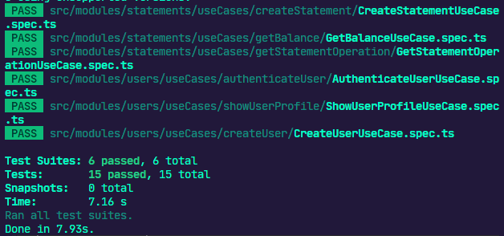

# Desafio 7 do Ignite Trilha NodeJS


<h3 align="center">
  Desafio 07: Desafio: Testes unitários
</h3>

<p align="center">
  
  <a href="https://app.rocketseat.com.br/me/matheus-marins">
    
  </a>
  <a href="https://github.com/rocketseat-education/ignite-template-tests-challenge/stargazers">
      
    </a>
  </p>

---

# :rocket: Sobre o desafio

Nesse desafio, criei testes unitários para uma aplicação já pronta usando tudo que aprendi até agora sobre testes.

Para que possa focar somente na parte de testes unitários sem precisar estudar muito a aplicação do zero, o template foi desenvolvido com base em uma aplicação já conhecida: **FinAPI**. A API construída no primeiro módulo da trilha.

 ### **Para saber tudo sobre o desafio acesse [NotionDesafio](https://www.notion.so/Desafio-01-Testes-unit-rios-0321db2af07e4b48a85a1e4e360fcd11).**
 
---
### :keyboard: Instalação e Execução do Projeto

- Clone este repositório

```
> git clone https://github.com/Mar0la/ignite-tests-challenge-main

```

- Navegue até o diretório principal do projeto

```
> cd ignite-tests-challenge-main

```

- Instale as dependências com o Yarn

```
yarn
```

- Também vamos ter que instalar as dependências jest e a supertest

```
yarn add jest supertest ts-jest
```

- Rode a suite de testes

```
yarn test
```

- Execute o projeto

```
yarn dev
```
---

**Obs: Lembrando que caso queria executar o supertest e necessario estar conectado a um banco de dados chamado fin_api**

---

### **Retorno que devemos ter ao digitar  <code>yarn test</code> no terminal** 
  - yarn jest 
    - 

---

## FeedBack do Desafio
  - Achei o Notion um pouco meio bah, acho que poderia ser melhor, o que acarretou em dificuldades desnecessarias.
---


